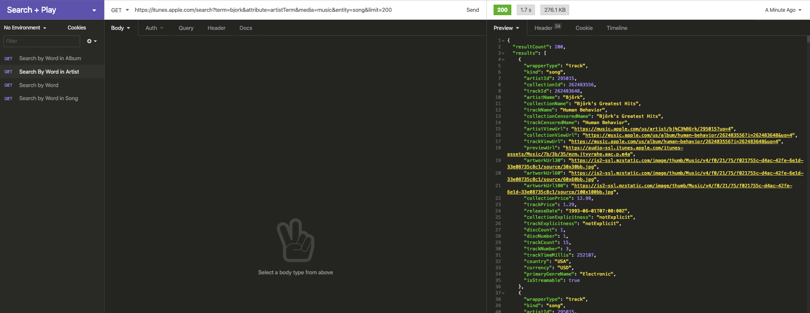
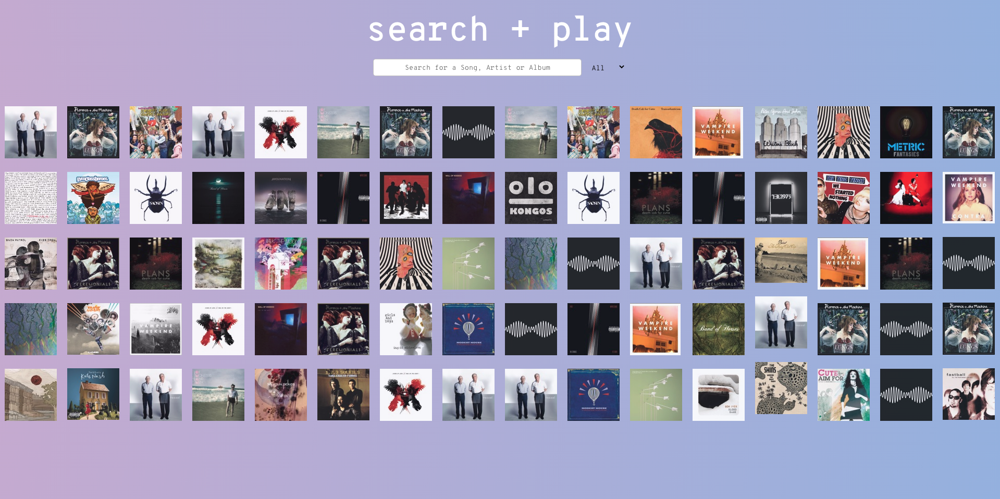

# General Assembly Project 2: Search + Play

**_Timeframe_**

36 hours

## Goal:

A pair-coded project to develop a React app using external APIs.

## Technologies Used

- iTunes Search API
- React.js
- JavaScript (ES6)
- HTML 5
- SASS/SCSS/CSS Animation
- Bulma
- Git/GitHub
- Axios
- React-Audio-Player

# Search + Play

An interactive & animated music preview app based on the [iTunes Search API](https://developer.apple.com/library/archive/documentation/AudioVideo/Conceptual/iTuneSearchAPI/Searching.html#//apple_ref/doc/uid/TP40017632-CH5-SW1)

### Deployed version

https://search-and-play.netlify.app/

## Code Installation

https://github.com/purvitrivedi/search-and-play

- Clone or download the repo
- Install yarn in Terminal by typing: <code>yarn</code>
- Start server with <code>yarn start</code>

## Planning

### Testing the API on Insomnia

We were pretty set on using a music-based API and since this was a hackathon, iTunes Search API was the most accessible.

The API returns 200 media (music, podcasts, videos etc.) results based on a query. For music media, the results included track details, album covers and previewTrackURL.

We found 4 queries that we could use on our app:

By default the API would give 50 results, so we added <code>limit=200</code> in the url as that is the maximum amount of results it can give us.

- Search by Word: https://itunes.apple.com/search?term=solange&media=music&entity=song&limit=200

- Search by Word in Song: https://itunes.apple.com/search?term=garden&attribute=songTerm&media=music&entity=song&limit=200

- Search by Word in Artist Name: https://itunes.apple.com/search?term=cutchemist&attribute=artistTerm&media=music&entity=song&limit=200

- Search by Word in Album Name: https://itunes.apple.com/search?term=butterfly&attribute=albumTerm&media=music&entity=song&limit=200

### Prototypes with Miro

We decided to have a simple two page app: Home Page (/) & Tracks Page (/tracks). The Tracks page would show all the results as an index until a user clicked on one of them. On click, the album index will skew,make space for the track and play it.

  

## Development

### The Home Page

The Home page along with the Search Bar make two common components of the app. On load, the homepage calls <code>componentDidMount</code> function using axios for the home page styling. The axios request <code>getAllSongs</code> is in the lib -> api.js file:

    export const getAllSongs = (term, attribute) => {
      if (attribute === 'Any') {
        return axios.get(`https://cors-anywhere.herokuapp.com/https://itunes.apple.com/search?term=${term}&media=music&entity=song&limit=200`)
      }
      else {
        return axios.get(`https://cors-anywhere.herokuapp.com/https://itunes.apple.com/search?term=${term}&attribute=${attribute}&media=music&entity=song&limit=200`)
      }
    }

<em><code>cors-anywhere.herokuapp</code> was added after the deployed on Heroku so we are not blocked by CORS policy.</em>

The search bar is a child component of the Home Page. It collects the search team and attribute(such as 'All', 'songTerm', 'artistTerm' & 'albumTerm'). Once we hit enter, we pass these as props by adding them to URL of the Music Index Page.

    handleSubmit = (event) => {
      let term = this.state.search.term
      if (!term) {
        this.setState({ validate: false })
        return
      }
      let attribute = (this.state.search.attribute ? this.state.search.attribute : 'Any')
      this.props.history.push(`/tracks/${term}&${attribute}`)
    }

### Music Index Page

On loading, the Music Index Component retrieves the 'term' and 'attribute' values from the URL and adds them to the <code>getAllSongs</code> GET request:

    const urlDetails = this.props.location.pathname
        const term = urlDetails.split('/')[2].split('&')[0].replace(' ', '+')
        const attribute = urlDetails.split('/')[2].split('&')[1]

There are two events on the displayed album covers:

onMouseEnter: show the track and artist name in the NavBar
onMouseClick: Skew the index and show the artist details and play the song.

    handleClick = (event) => {
      this.setState({ isSkewedIndex: true })
      setTimeout(() => { this.setState({ singleArtist: event, isShowingArtist:  true, volume: 0.6 }) }, 500)
    }

We enable the page to show the track on the right side by using Boolean state values and conditional rendering.

    

        <MusicShow
        {...this.state.singleArtist}
        onClick={this.handleBackClick}
        volume={this.state.volume}/>
    

### Artist Show Section:

On click, the index skews to left half of the page:

    .skew {
      transform: rotateY(55deg) skew(-13deg) scale(0.95);
      box-shadow: 4px 10px 36px -2px rgb(241, 240, 169);

      @media (max-width: 800px) {
        display: none;
      }
    }

and the Artist show section comes in with Sliding Animation:

    .slidingAnimation {
      animation: slide 1s ease;
      animation-fill-mode: forwards;
      background-image: linear-gradient(
        to right,
        rgba(247, 247, 247, 0),
        rgb(10, 10, 9)
      );
      right: -400px;
    }

    @keyframes slide {
      100% {
        right: 0px;
      }
    }

In this page, we use the React Audio Player as it's slightly better than HTML5 Audio player. We set it to 'autoplay' so the song begins playing as the page animates into this section:

    <ReactAudioPlayer autoPlay controls={true} src={props.previewUrl} volume={props.volume}/>

### Finishing Touches & Styling

In the last 4-5 hours, we focused on adding some finishing touches:

* Adding back button on the Music Index Page
* Styling the artist show section with flexbox
* Adding flashes to the music index. This was done by re-rendering the page on a timer and assigning <code>className="flash"</code> to random albums.
* Styling the Home Page

## Wins

Styling :sparkles: . Very pleased with how fun this app is, we learnt so much about animations, timers and using conditonal rendering.

Teamwork :raised_hands: . This was the first time I pair-coded for almost 2 days and it was a wonderful experience. Rob and I were always in sync and found that bouncing personal ideas off each other always resulted in something better.

## Challenges

CORS :no_entry_sign: . While were able to solve this easily after deployment, the why of it took me a while to fully understand. Our tutor was very helpful in explaining CORS in details.

## Key Learnings

* React.js: As this was my first React App, I learned a lot about conditional rendering, how state works and how to pass props using URLs.

* CSS Animations: Not only was this fun, but I feel very confident working with transitions and animations after this project.

## Future Improvements

* Make it Responsive(Done)
* Audio Fade in and out

