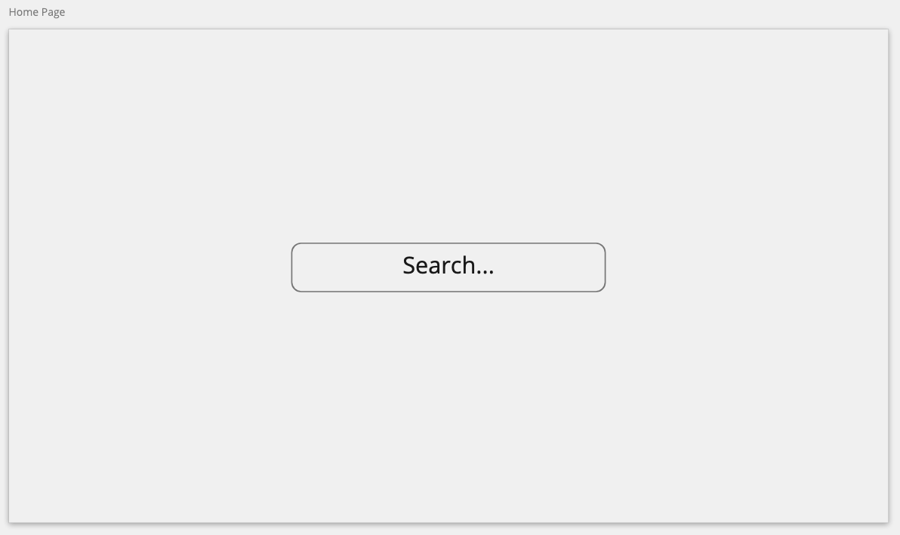
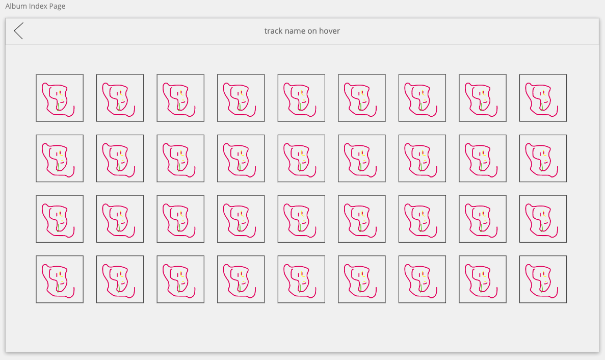
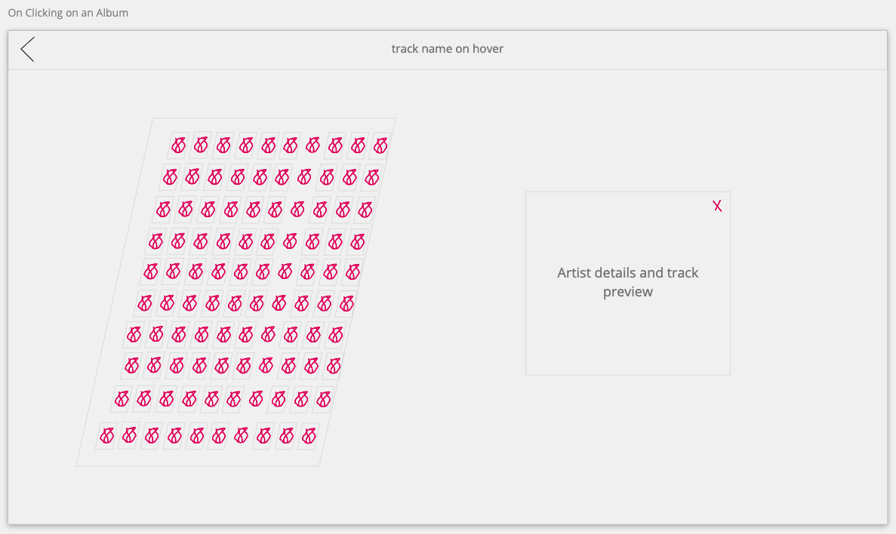

# General Assembly Project 2: Search + Play

**_Timeframe_**

36 hours

## Goal:

A pair-coded project to develop a React app using external APIs.

## Technologies Used

- iTunes Search API
- React.js
- JavaScript (ES6)
- HTML 5
- SASS/SCSS/CSS Animation
- Bulma
- Git/GitHub
- Axios
- React-Audio-Player

# Search + Play

An interative & animated music search & preview app based on the [iTunes Search API](https://developer.apple.com/library/archive/documentation/AudioVideo/Conceptual/iTuneSearchAPI/Searching.html#//apple_ref/doc/uid/TP40017632-CH5-SW1)

### Deployed version

https://search-and-play.netlify.app/

## Code Installation

https://github.com/purvitrivedi/search-and-play

- Clone or download the repo
- Install yarn in Terminal by typing: <code>yarn</code>
- Start server with yarn start

## Planning

### Understanding the API results on Insomnia

We were pretty set on using a music-based API and since this was a hackthon - iTunes Search API was the most accessible in terms of timing.

The API returns 200 media (music,podcasts, videos etc.) results based on a query. For music media, the results included track details, album covers and previewTrackURL.

We found 4 queries that we could use on our app.:

By default the API would give 50 results, so we added <code>limit=200</code> in the url as that is the maximum amount of results it can give us.

- Search by Word:

    https://itunes.apple.com/search?term=solange&media=music&entity=song&limit=200

- Search by Word in Song:

    https://itunes.apple.com/search?term=garden&attribute=songTerm&media=music&entity=song&limit=200

* Search by Word in Artist Name:

    https://itunes.apple.com/search?term=cutchemist&attribute=artistTerm&media=music&entity=song&limit=200

- Search by Word in Album Name:

    https://itunes.apple.com/search?term=butterfly&attribute=albumTerm&media=music&entity=song&limit=200

### Prototypes with Miro

We decided to have a simple two page app: Home Page (/) & Tracks Page (/tracks). The Tracks page would show all the results as an index until a user clicked on them. Once a user has clicked on an album cover, the album index will skew and make space for the track.

### Pseudocoding

## Development Process

### Routing, Home Page & Search Bar

using url to pass props

### Album Index Page

### Artist Show Page

### Finishing Touches & Styling
